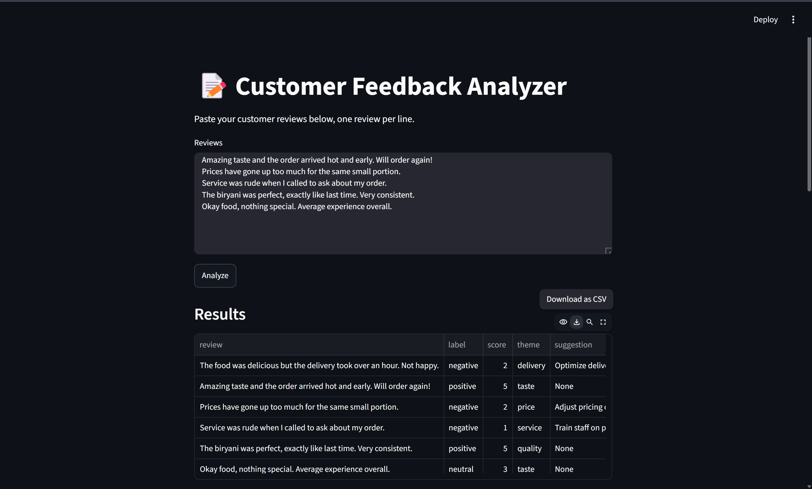
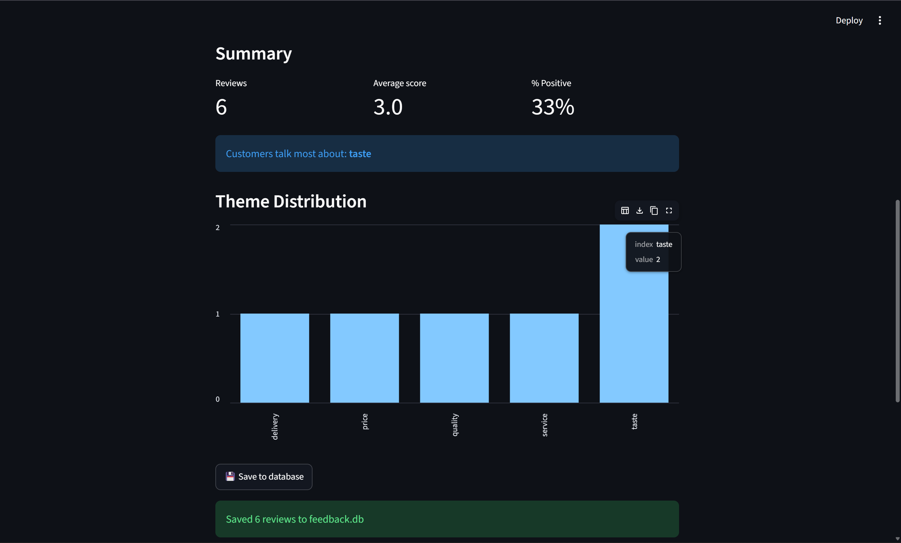
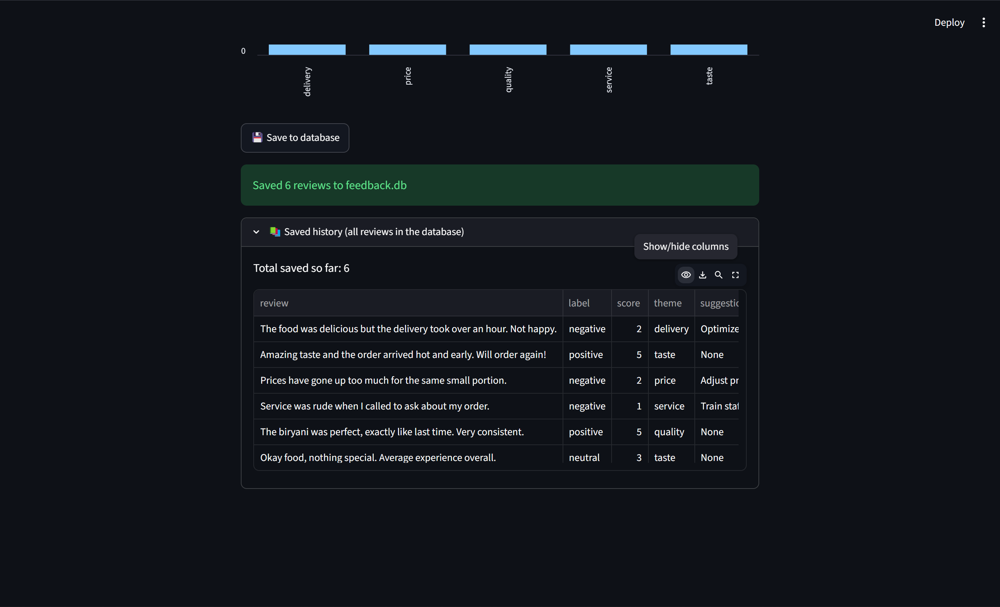

# 📝 AI Customer Feedback Analyzer

An AI-powered customer feedback analyzer built with Python, Streamlit, FastAPI, SQLite, and the Gemini API.

The application allows a business owner to paste multiple customer reviews, analyze them using Gemini, and view the sentiment, rating, and main theme of each review.

---

## 🚀 Features

- Analyze multiple customer reviews at once
- Classify reviews as:
  - Positive
  - Negative
  - Neutral
- Generate a 1–5 score for each review
- Identify the main theme of each review
- Display results in a structured table
- Calculate:
  - Total number of reviews
  - Average score
  - Percentage of positive reviews
- Identify the most frequently mentioned theme
- Save analyzed reviews to a local SQLite database
- View previously saved reviews
- FastAPI backend separated from the Streamlit frontend
- Structured AI responses using Pydantic

---

## 🛠️ Tech Stack

### Frontend
- Python
- Streamlit

### Backend
- FastAPI
- Pydantic
- Requests

### AI
- Google Gemini API
- Google GenAI Python SDK

### Database
- SQLite

### Development
- uv
- Git / GitHub

---

## 📸 Screenshots

### Main Dashboard

The Streamlit dashboard allows users to enter multiple customer reviews, one review per line, and analyze them using the AI backend.




### Analysis Results

The application displays the sentiment label, score, main theme, and AI-generated suggestion for each review.


### Summary and Theme Distribution

The dashboard summarizes the number of reviews, average score, percentage of positive reviews, and the most frequently discussed theme.

A bar chart visualizes how frequently each theme appears across the analyzed reviews.




### Saved Review History

Analyzed reviews can be saved to a local SQLite database and viewed later through the saved history section.



---

## 🏗️ Project Architecture

```text
                  ┌─────────────────────┐
                  │     Streamlit UI    │
                  │       app.py        │
                  └──────────┬──────────┘
                             │
                             │ HTTP POST
                             ▼
                  ┌─────────────────────┐
                  │     FastAPI API     │
                  │       api.py        │
                  └──────────┬──────────┘
                             │
                             │ Gemini API
                             ▼
                  ┌─────────────────────┐
                  │    Google Gemini    │
                  └─────────────────────┘

                  ┌─────────────────────┐
                  │      SQLite DB      │
                  │    database.py      │
                  └─────────────────────┘

---

